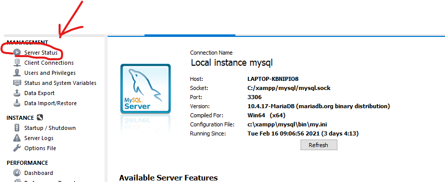
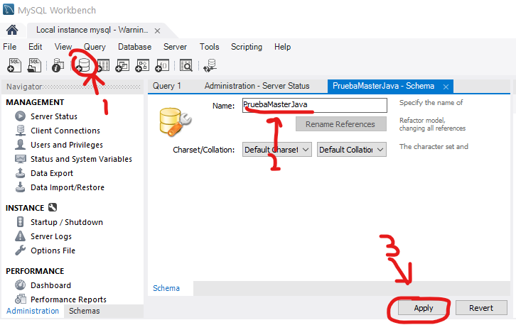
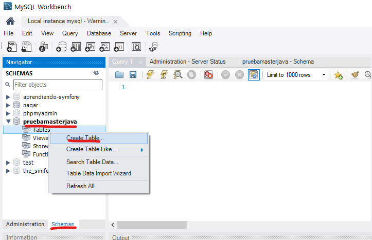
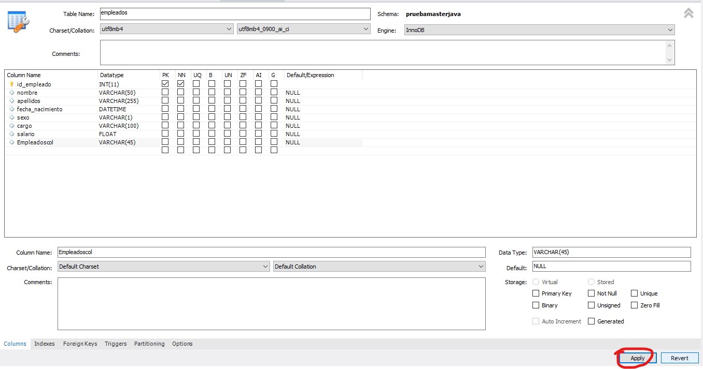
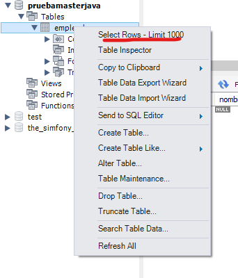
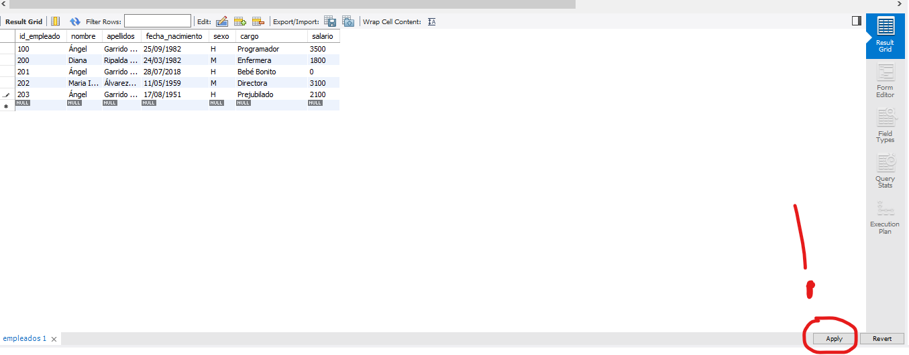
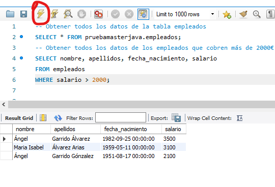

# SQL


Este repositorio contiene resúmenes teóricos y ejercicios prácticos realizados por Ángel Garrido Álvarez durante: 
* Máster en Diseño y Programación de Aplicaciones Java JEE - Universidad de Alcalá - 2021
* Bootcamp Fullstack Developer - Upgrade-Hub - 2020
# mySQL en consola
[Ejercicios Bootcamp](apuntes.sql)
* Instalación MySQL
* Creación de Bases de Datos
* Creación de tablas
* Inserción de Registros
* Resolución de consultas

________________________________________________________________________

# MySQL Workbench - mySQL interfaz gráfica
1. Comprobamos que está conectado con el servidor:


2. Create a new schema in the connected server
* Elegimos nombre de nuestro Schema 
* pulsamos apply



3. Schemas --> Tables --> Create New Table


4. Creamos nuestros campos y pulsamos apply


5. Rellenamos la tabla con información
    * empleado --> slect rows limit 1000



6. Una vez rellenada la tabla ¡Importante pulsar apply!


* Por defecto nos viene una consulta hecha que pide todos los datos de la tablar:
```sql
-- Obtener todos los datos de la tabla empleados 
SELECT * FROM pruebamasterjava.empleados;
```


7. Podemos hacer consultas desde MySQL Workbench usando código y pulsando en el símbolo del rayo.
```sql
-- Obtener todos los datos de los empleados que cobren más de 2000€
SELECT nombre, apellidos, fecha_nacimiento, salario
FROM empleados
WHERE salario > 2000;
```


8. Algunas consultas básicas adicionales:

```sql
-- Obtener cuánto cuesta a la empresa pagar a todos sus empleados:
SELECT sum(salario) AS total_salarios
FROM empleados;

-- ¿Qué cantidad de empleados hay en la empresa?
SELECT count(*) AS Cantidad_empleados
FROM empleados;

-- Obtener el salario medio de los empleados
SELECT sum(salario)/count(*) AS Salario_Medio_Empleados
FROM empleados;

-- La consulta anterior equivale a
SELECT AVG(salario) as Salario_Medio_Empleados_II
FROM empleados;

-- Obtener el salario máximo y el salario mínimo de los empleados
SELECT min(salario) AS Salario_Min, max(salario) AS Salario_Max
FROM empleados;

-- Obtener nombre, apellidos y salario del empleado que tiene el salario mínimo.
SELECT nombre, apellidos, salario AS salario_min
FROM empleados
WHERE salario = 0;

-- Obtener todas las mujeres que trabajan en la empresa
SELECT *
FROM empleados
where sexo = 'M';

SELECT *
FROM empleados
WHERE nombre like '%el';
```


